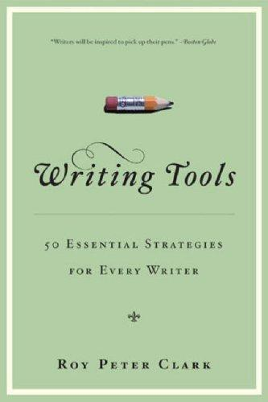

# writing-tools

A free, open-source [Claude Code](https://claude.com/claude-code) skill that helps you write new content or clean up an existing draft, guided by the 51 writing tools from Roy Peter Clark's book **[Writing Tools: 50 Essential Strategies for Every Writer](https://www.hachettebookgroup.com/titles/roy-peter-clark/writing-tools-10th-anniversary-edition/9780316211307/)**.

<p align="center">
  
</p>

This skill is based on and inspired by Clark's book. If the tools here help you, buy the book. It is one of the best books on the craft of writing ever published, and the one-line summaries in this skill are no substitute for Clark's full chapters, examples, and workshop exercises.

## What it does

Type `/writing-tools` in Claude Code and the skill will:

1. Ask whether you are **writing something new** or **editing an existing draft**.
2. Ask what **type of content** it is (email, memo, slide notes, short-form copy, landing page, or long-form article).
3. Apply only the subset of Clark's tools that fit that content type. An email gets "Cut Big, Then Small" and "Branch to the Right." A long explainer gets "Place Gold Coins Along the Path" and "Write a Mission Statement for Your Story."
4. Show its work. Every draft or rewrite ends with a short list of which tools drove the biggest choices, so you learn the craft while you use it.

It also enforces one house rule: no em dashes, ever.

## Installation

### Claude Code (personal skill, available in every project)

```bash
git clone https://github.com/jimmiet42/writing-tools-skill.git ~/.claude/skills/writing-tools
```

That's it. Open Claude Code and type `/writing-tools`.

### Claude Code (project skill, shared with your team)

From the root of your project:

```bash
git clone https://github.com/jimmiet42/writing-tools-skill.git .claude/skills/writing-tools
```

Commit the folder and everyone who works in the repo gets the skill.

### Manual install

Download this repo as a ZIP (green **Code** button, then **Download ZIP**), unzip it, and place the folder at `~/.claude/skills/writing-tools`. The `SKILL.md` file must sit at the top of that folder.

### Updating

```bash
cd ~/.claude/skills/writing-tools && git pull
```

## Usage

```
/writing-tools                          ask it to write or edit, it will walk you through it
/writing-tools <paste your draft>       jumps straight into edit mode
/writing-tools write a landing page for my dog-walking app
```

The skill only activates when you explicitly type `/writing-tools`. It will not hijack ordinary writing or editing requests.

## What's inside

| File | Purpose |
|---|---|
| `SKILL.md` | The skill's instructions: how it routes requests, asks for content type, and formats output |
| `tools-index.md` | A condensed index of all 51 tools: a one-line principle plus a "when to reach for it" note for each |
| `content-type-map.md` | Which tools apply to which content type (email, memo, slides, short-form, landing page, long-form) |

## Attribution and copyright

- The 51 writing tools are the work of **Roy Peter Clark**, from *Writing Tools: 50 Essential Strategies for Every Writer* (Little, Brown and Company). Clark also published a free [Quick List of the tools via the Poynter Institute](https://www.poynter.org/reporting-editing/2004/writing-tool-box-50-tools-you-can-use/).
- This project is an independent fan work. It is **not affiliated with, endorsed by, or sponsored by** Roy Peter Clark, the Poynter Institute, or Little, Brown and Company.
- The book cover image is included solely to identify the book being credited. All rights to the cover and the book belong to their respective owners. If you are a rights holder and want the image or anything else removed, open an issue and it will come down promptly.
- The tool summaries and "when to reach for it" notes are short paraphrases written for this skill. Buy the book for the real thing.

## License

The original files in this repository (the skill instructions, routing logic, and content-type mappings) are released under the [MIT License](LICENSE). The license covers this repository's text only. It grants no rights to Roy Peter Clark's book or its contents.

## Credits

- **Roy Peter Clark**, for the 51 tools and a lifetime of teaching writing.
- Inspired by [gnurio/tufte-vdqi-plugin](https://github.com/gnurio/tufte-vdqi-plugin), which did the same for Edward Tufte's data-visualization principles.
- Maintained by [Jimmie Thongkham](https://jimmiethongkham.com).
